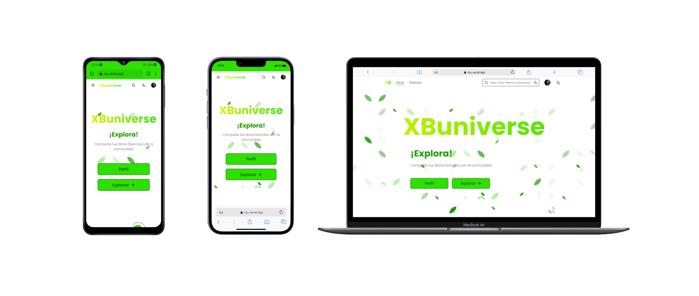

<h1 align="center">XBuniverse</h1>


<p align="center">
  <a aria-label="License" href="LICENSE">
    
  </a>
  <a aria-label="GitHub Pull Requests" href="">
    
  </a>
  <a aria-label="GitHub contributors" href="https://github.com/Franqsanz/xbu/graphs/contributors">
    
  </a>
</p>

## ¿Qué es XBuniverse?

XBuniverse es un sitio web dedicado a los amantes de la lectura y la literatura. Es un espacio diseñado para compartir y descubrir libros de diversas temáticas.


* **Explora una amplia selección de libros:** Accede a una extensa biblioteca de títulos que abarcan géneros literarios como ficción, no ficción, ciencia ficción, misterio, romance y muchos más.

* **Explora Temáticas Específicas:** ¿Te apasiona la ciencia ficción? ¿O prefieres los thrillers? Filtra tus búsquedas por género, autor o año para encontrar exactamente lo que deseas.

* Crea una cuenta en XBuniverse para compartir tus libros favoritos con otros amantes de la lectura.

¡Únete a XBuniverse y sumérgete en el fascinante mundo de la lectura! Explora y comparte.

## Contribuir

1. Clonar el repositorio:

```sh
git clone https://github.com/Franqsanz/xbu.git
```

2. Acceder a la carpeta:
```sh
cd xbu
```

3. Instalar las dependencias y ejecutar el proyecto:
```sh
npm install

npm run dev
```
