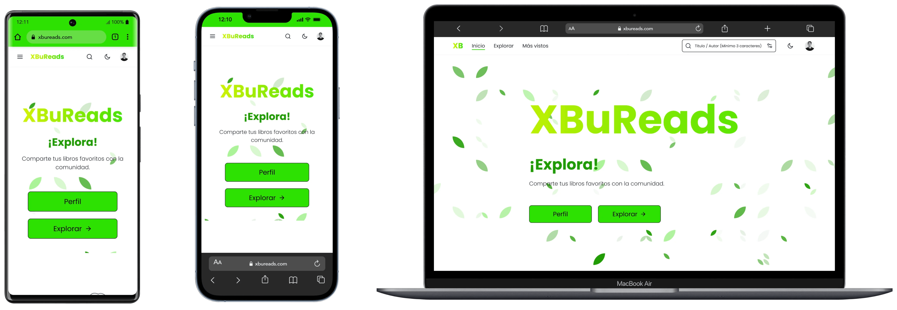
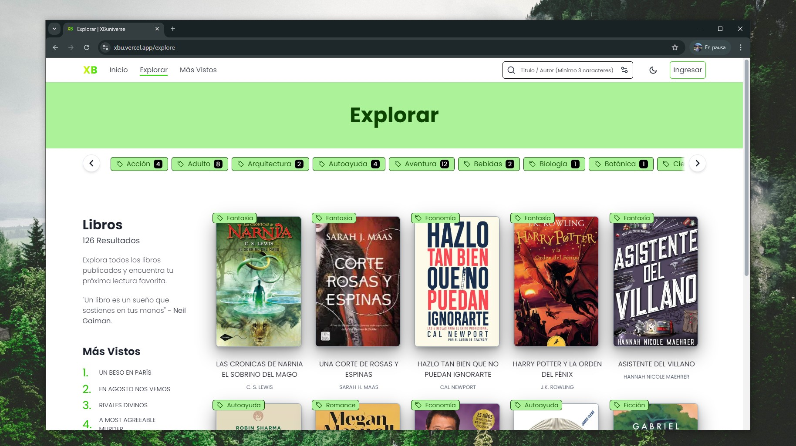

<h1 align="center">XBuReads</h1>

<p align="center">
  
</p>
<p align="center">
  <a aria-label="License" href="LICENSE">
    
  </a>
  <a aria-label="GitHub Pull Requests" href="">
    
  </a>
  <a aria-label="GitHub contributors" href="https://github.com/Franqsanz/xbu/graphs/contributors">
    
  </a>
</p>

## ¿Qué es XBuReads?

XBuReads es un sitio web dedicado a los amantes de la lectura y la literatura. Es un espacio diseñado para compartir y descubrir libros de diversas temáticas.

* **Explora una amplia selección de libros:** Accede a una extensa biblioteca de títulos que abarcan géneros literarios como ficción, no ficción, ciencia ficción, misterio, romance y muchos más.

* **Explora Temáticas Específicas:** ¿Te apasiona la ciencia ficción? ¿O prefieres los thrillers? Filtra tus búsquedas por género, autor o año para encontrar exactamente lo que deseas.

* **Agregar libros a favoritos**: Permite marcar libros como favoritos para un acceso rápido.

* **Crear colecciones de libros**: Permite organizar libros en colecciones personalizadas según las preferencias del usuario.

* **Crear comentarios:** Permite a los usuarios dejar comentarios en cada libro, con la posibilidad de editarlos, eliminarlos y gestionar reacciones (likes/dislikes) tanto en comentarios propios como de otros usuarios.

* **Sistema de seguimiento:** Permite seguir y dejar de seguir a otros lectores, ver listas de seguidores y seguidos en un modal con scroll infinito, y consultar las estadísticas desde el perfil de cualquier usuario.

* **Feed de actividad social:** Al iniciar sesión, la home se transforma en un feed cronológico con los libros publicados y comentarios de los usuarios que seguís. Si no seguís a nadie, ofrece un acceso directo a Explorar.

¡Únete a XBuReads y sumérgete en el fascinante mundo de la lectura! Explora y comparte.

---



## Contribuir

1. Clonar el repositorio:

```sh
git clone https://github.com/Franqsanz/xbu.git
```

2. Acceder a la carpeta:

```sh
cd xbu
```

3. Instalar las dependencias y ejecutar el proyecto:

```sh
npm install

npm run dev
# O
pnpm install

pnpm run dev
```

## License

[MIT © 2025](./LICENSE) Franco Andrés Sánchez
